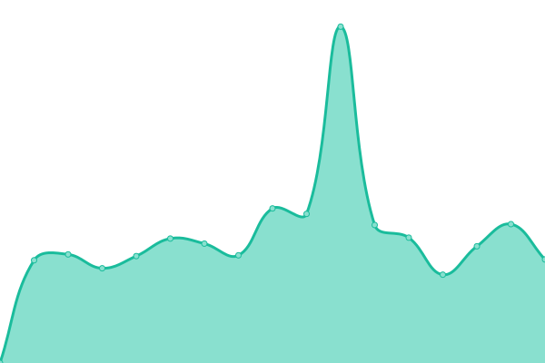

# [📈 Live Status](https://matiwiber.github.io/status-page): <!--live status--> **🟧 Partial outage**

This repository contains the open-source uptime monitor and status page for [Matías Weber](https://matiwiber.github.io/status-page), powered by [Upptime](https://github.com/upptime/upptime).

With [Upptime](https://upptime.js.org), you can get your own unlimited and free uptime monitor and status page, powered entirely by a GitHub repository. We use [Issues](https://github.com/matiwiber/status-page/issues) as incident reports, [Actions](https://github.com/matiwiber/status-page/actions) as uptime monitors, and [Pages](https://matiwiber.github.io/status-page) for the status page.

<!--start: status pages-->
<!-- This summary is generated by Upptime (https://github.com/upptime/upptime) -->
<!-- Do not edit this manually, your changes will be overwritten -->
<!-- prettier-ignore -->
| URL | Status | History | Response Time | Uptime |
| --- | ------ | ------- | ------------- | ------ |
|  [Ministerio de Seguridad](www.mseg.gba.gov.ar) | 🟩 Up | [ministerio-de-seguridad.yml](https://github.com/matiwiber/status-page/commits/HEAD/history/ministerio-de-seguridad.yml) | 

 2177ms
     
 | 

<a href="https://matiwiber.github.io/status-page/history/ministerio-de-seguridad">100.00%</a>
    

|  [Mi Portal](https://miportal.mseg.gba.gov.ar/) | 🟥 Down | [mi-portal.yml](https://github.com/matiwiber/status-page/commits/HEAD/history/mi-portal.yml) | 

 0ms
     
 | 

<a href="https://matiwiber.github.io/status-page/history/mi-portal">0.00%</a>
    

|  [Antecedentes](https://antecedentes.mseg.gba.gov.ar) | 🟥 Down | [antecedentes.yml](https://github.com/matiwiber/status-page/commits/HEAD/history/antecedentes.yml) | 

 0ms
     
 | 

<a href="https://matiwiber.github.io/status-page/history/antecedentes">0.00%</a>
    

|  [Subjefatura Policia](www.policia.mseg.gba.gov.ar) | 🟩 Up | [subjefatura-policia.yml](https://github.com/matiwiber/status-page/commits/HEAD/history/subjefatura-policia.yml) | 

 1223ms
     
 | 

<a href="https://matiwiber.github.io/status-page/history/subjefatura-policia">100.00%</a>
    

<!--end: status pages-->

[**Visit our status website →**](https://matiwiber.github.io/status-page)

## 📄 License

- Powered by: [Upptime](https://github.com/upptime/upptime)
- Code: [MIT](./LICENSE) © [Matías Weber](https://matiwiber.github.io/status-page)
- Data in the `./history` directory: [Open Database License](https://opendatacommons.org/licenses/odbl/1-0/)
